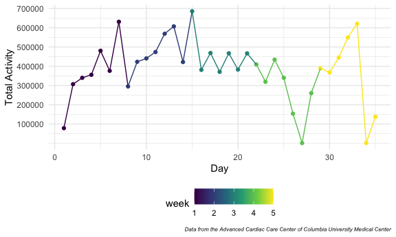
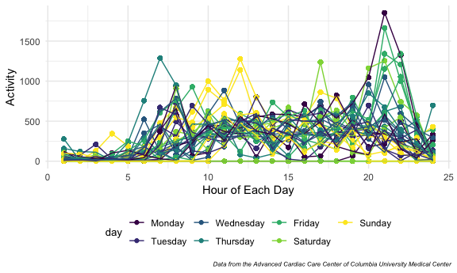
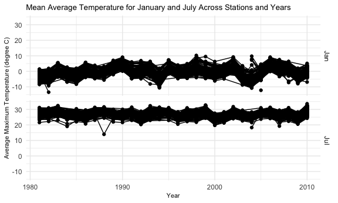
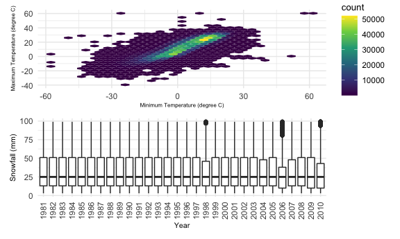

Homework 3
================
Yan Song
2020-10-10

### Due date

Due: October 10 at 10:00pm.

### Points

| Problem         | Points    |
| :-------------- | :-------- |
| Problem 0       | 20        |
| Problem 1       | –         |
| Problem 2       | 40        |
| Problem 3       | 40        |
| Optional survey | No points |

### Problem 0

This “problem” focuses on structure of your submission, especially the
use git and GitHub for reproducibility, R Projects to organize your
work, R Markdown to write reproducible reports, relative paths to load
data from local files, and reasonable naming structures for your files.

### Problem 1

``` r
data("instacart")
```

This dataset contains 1384617 rows and … columns.

Observations are the level of items in orders by user. There are user /
order variables – user ID, order ID, order day, and order hour. There
are also item variables – name, aisle, department, and some numeric
codes.

-----

How many aisles, and which are most items from?

``` r
instacart %>% 
    count(aisle) %>% 
    arrange(desc(n))
```

    ## # A tibble: 134 x 2
    ##    aisle                              n
    ##    <chr>                          <int>
    ##  1 fresh vegetables              150609
    ##  2 fresh fruits                  150473
    ##  3 packaged vegetables fruits     78493
    ##  4 yogurt                         55240
    ##  5 packaged cheese                41699
    ##  6 water seltzer sparkling water  36617
    ##  7 milk                           32644
    ##  8 chips pretzels                 31269
    ##  9 soy lactosefree                26240
    ## 10 bread                          23635
    ## # … with 124 more rows

Let’s make a plot

``` r
instacart %>% 
    count(aisle) %>% 
    filter(n > 10000) %>% 
    mutate(
        aisle = factor(aisle),
        aisle = fct_reorder(aisle, n)
    ) %>% 
    ggplot(aes(x = aisle, y = n)) + 
    geom_point() + 
    theme(axis.text.x = element_text(angle = 90, vjust = 0.5, hjust = 1))
```


Let’s make a table\!\!

``` r
instacart %>% 
    filter(aisle %in% c("baking ingredients", "dog food care", "packaged vegetables fruits")) %>% 
    group_by(aisle) %>% 
    count(product_name) %>% 
    mutate(rank = min_rank(desc(n))) %>% 
    filter(rank < 4) %>% 
    arrange(aisle, rank) %>% 
    knitr::kable()
```

| aisle                      | product\_name                                 |    n | rank |
| :------------------------- | :-------------------------------------------- | ---: | ---: |
| baking ingredients         | Light Brown Sugar                             |  499 |    1 |
| baking ingredients         | Pure Baking Soda                              |  387 |    2 |
| baking ingredients         | Cane Sugar                                    |  336 |    3 |
| dog food care              | Snack Sticks Chicken & Rice Recipe Dog Treats |   30 |    1 |
| dog food care              | Organix Chicken & Brown Rice Recipe           |   28 |    2 |
| dog food care              | Small Dog Biscuits                            |   26 |    3 |
| packaged vegetables fruits | Organic Baby Spinach                          | 9784 |    1 |
| packaged vegetables fruits | Organic Raspberries                           | 5546 |    2 |
| packaged vegetables fruits | Organic Blueberries                           | 4966 |    3 |

Apples vs ice cream..

``` r
instacart %>% 
    filter(product_name %in% c("Pink Lady Apples", "Coffee Ice Cream")) %>% 
    group_by(product_name, order_dow) %>% 
    summarize(mean_hour = mean(order_hour_of_day)) %>% 
    pivot_wider(
        names_from = order_dow,
        values_from = mean_hour
    )
```

    ## `summarise()` regrouping output by 'product_name' (override with `.groups` argument)

    ## # A tibble: 2 x 8
    ## # Groups:   product_name [2]
    ##   product_name       `0`   `1`   `2`   `3`   `4`   `5`   `6`
    ##   <chr>            <dbl> <dbl> <dbl> <dbl> <dbl> <dbl> <dbl>
    ## 1 Coffee Ice Cream  13.8  14.3  15.4  15.3  15.2  12.3  13.8
    ## 2 Pink Lady Apples  13.4  11.4  11.7  14.2  11.6  12.8  11.9

### Problem 2

Read and clean accelerometers dataset.

``` r
accel_data = 
  read_csv(file = "./data/accel_data.csv") %>% 
  pivot_longer(
    activity.1:activity.1440,
    names_to = "minute",
    names_prefix = "activity.",
    values_to = "activity"
  ) %>% 
  mutate(
    minute = as.numeric(minute),
    day_1 = day, 
    day_1 = recode(day, "Monday" = "1" ,"Tuesday" =  "2", "Wednesday" = "3", "Thursday" = "4", "Friday" = "5", "Saturday" = "6", "Sunday" = "7"),
    weekday_type = ifelse(day_1 > 5, "weekend", "weekday"),
    day = factor(day, order = TRUE, levels = c("Monday","Tuesday","Wednesday", "Thursday" , "Friday", "Saturday","Sunday"))
  ) %>% 
  arrange(day) %>% 
  select(-day_1)
```

    ## Parsed with column specification:
    ## cols(
    ##   .default = col_double(),
    ##   day = col_character()
    ## )

    ## See spec(...) for full column specifications.

There is 50400 rows and 6 columns in this dataset. The variables
contains : *week: from 1 to 5 *day\_id: from 1 to 35 *day: Monday to
Sunday *weekday\_type:(weekday or weekend): *minute(the minute of the
day): *activity: the activity counts for each minute

There is 50400 observation.

-----

Create a readable table showing total activity for each day.

``` r
total_activity_a_day = 
  accel_data %>% 
  group_by(week,day) %>% 
  summarize(
    total_each_day = sum(activity)
  )
```

    ## `summarise()` regrouping output by 'week' (override with `.groups` argument)

``` r
table_for_total = 
  total_activity_a_day %>% 
  pivot_wider(
    names_from = "day",
    values_from = "total_each_day"
  )

knitr::kable(table_for_total, digits = 2)
```

| week |    Monday |  Tuesday | Wednesday | Thursday |   Friday | Saturday | Sunday |
| ---: | --------: | -------: | --------: | -------: | -------: | -------: | -----: |
|    1 |  78828.07 | 307094.2 |    340115 | 355923.6 | 480542.6 |   376254 | 631105 |
|    2 | 295431.00 | 423245.0 |    440962 | 474048.0 | 568839.0 |   607175 | 422018 |
|    3 | 685910.00 | 381507.0 |    468869 | 371230.0 | 467420.0 |   382928 | 467052 |
|    4 | 409450.00 | 319568.0 |    434460 | 340291.0 | 154049.0 |     1440 | 260617 |
|    5 | 389080.00 | 367824.0 |    445366 | 549658.0 | 620860.0 |     1440 | 138421 |

The trends are not apparent.

-----

Draw a plot to see the trends.

``` r
total_activity_a_day %>% 
  ungroup(week,day) %>% 
  mutate(day_number = row_number()) %>% 
  ggplot(aes(x = day_number, y = total_each_day, color = week)) + 
  geom_point() + 
  geom_line() + 
  scale_y_continuous(
  breaks = c(100000,200000,300000,400000,500000,600000,700000,800000), 
  labels = c("100000","200000","300000","400000","500000","600000","700000", "800000")
    ) + 
  labs(
    x = "Day",
    y = "Total activity",
    caption = "Data from the Advanced Cardiac Care Center of Columbia University Medical Center"
  )
```



Now we could see the trends of total activity for each day.

-----

Draw a single-panel plot that shows the 24-hour activity time courses
for each day.

``` r
accel_data %>% 
  mutate(
    hour = ceiling(minute/60)
  ) %>% 
  group_by(day_id, hour) %>% 
  mutate(mean_act = mean(activity)) %>% 
  ggplot(aes(x = hour, y = mean_act, color = day, group = day_id)) +
  geom_point()+
  geom_line() +
  labs(
    x = "Hour of each day",
    y = "Activity",
    caption = "Data from the Advanced Cardiac Care Center of Columbia University Medical Center" )
```



We could see that this man’s activity counts was high in 9pm on Friday
and was inactive during 0am to 8am everyday.

### Problem 3

Load ny\_noaa dataset.

``` r
library(p8105.datasets)
data("ny_noaa")
```

Clean and data and create separate variables for year, month, and day.

``` r
weather_df= ny_noaa %>% 
  janitor::clean_names() %>% 
  separate(date,into = c("year", "month", "day"), sep = "-") %>% 
  mutate(
    year = as.integer(year),
    month = as.integer(month),
    month = month.abb[month],
    tmin = as.numeric(tmin),
    tmax = as.numeric(tmax),
    tmax = tmax / 10,
    tmin = tmin / 10,
    prcp = prcp / 10
)
```

Next, check the most commonly observed values for snowball.

``` r
snow = weather_df$snow 
snow_mode= names(table(snow))[table(snow) == max(table(snow))]  
```

For snowfall, the most commonly observed values is 0.

-----

Make a two-panel plots showing the average max temperature in January
and July in each station across years.

``` r
weather_df %>%
filter(month %in% c("Jan", "Jul")) %>%
group_by(id, year, month) %>%
summarize(avtmaxd = mean(tmax, na.rm = TRUE), .groups = 'drop') %>%
ggplot(aes(x = year, y = avtmaxd, group = id)) +
geom_line()+
geom_point()+
facet_grid(month ~.)+
labs(title = "Mean Average Temperature for January and July Across Stations and Years", x = "Year", y = "Average Maximum Temperature (C)") +
theme(axis.title = element_text(size = 8),
      plot.title = element_text(size = 10))
```

    ## Warning: Removed 5640 row(s) containing missing values (geom_path).

    ## Warning: Removed 5970 rows containing missing values (geom_point).


This plots shows an increasing trend in the average maximum temperature
in January and July across the years, which could be an indicator of
global warming. Also, there are several outliers in the January plot in
1982, 2005 that show much lower average maximum temperature to the other
years while some outliers in 2004 has much higher average maximum
temperature than the other years. In the plot of July, there are several
outliers in the year of 1988, 2004 and 2007 show lower average maximum
temperature to other years.

-----

Make a two-panel plot showing (i) tmax vs tmin for the full dataset
(note that a scatterplot may not be the best option); and (ii) make a
plot showing the distribution of snowfall values greater than 0 and less
than 100 separately by year.

``` r
tmax_min_p = weather_df %>%
  drop_na(tmin,tmax)%>%
  ggplot(aes(x = tmin, y = tmax)) +
  geom_hex()+
  theme (legend.position = "right",
    legend.title = element_text(size=10)
  )

snowfall_df = weather_df %>%
  filter (0 < snow, snow < 100) %>%
  group_by(year) %>%
  select(year, snow) %>% 
  mutate(year = as.character(year)) %>% 
  ggplot(aes(x= year, y= snow)) +
  geom_boxplot()+
  theme(axis.text.x = element_text (angle = 90, vjust = 0.5, hjust = 1))
tmax_min_p / snowfall_df 
```


